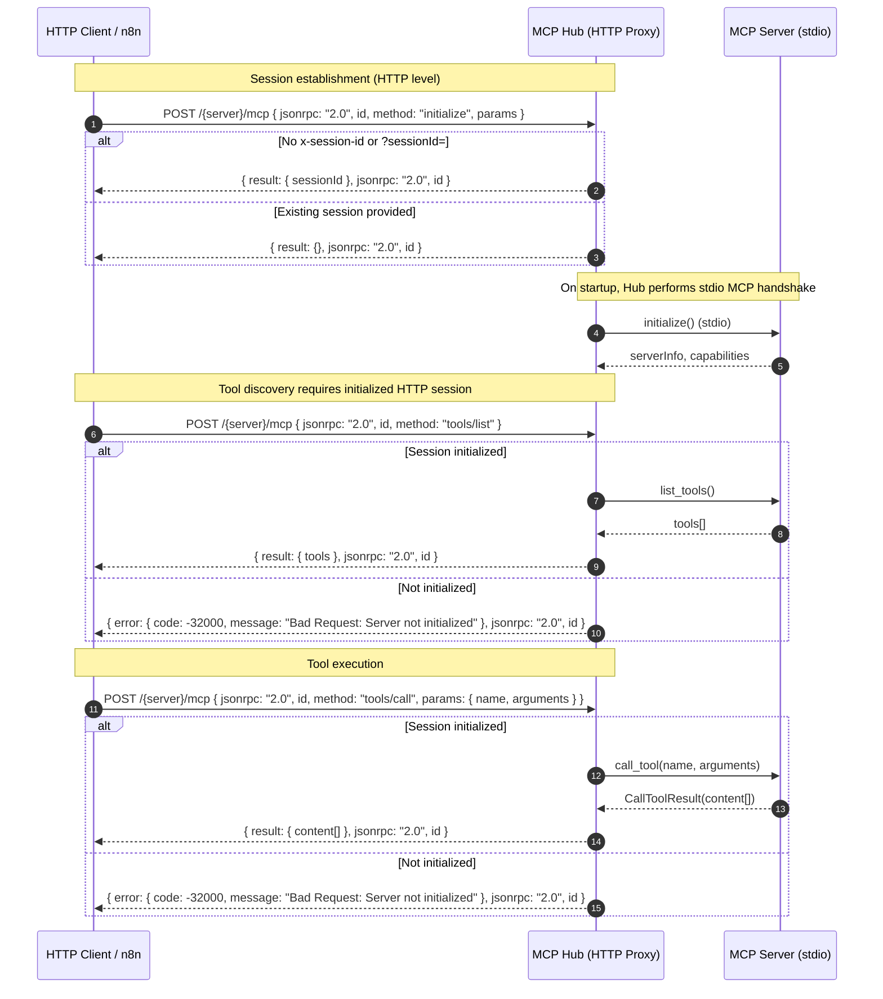

# ⚡️ MCP Hub

**Pure stdio MCP Gateway for aggregating multiple Model Context Protocol servers.**

MCP Hub is a simplified, pure stdio aggregator that runs multiple MCP servers through a single HTTP gateway. Unlike complex solutions, MCP Hub executes and manages all your MCP servers internally through stdio only, exposing them through clean HTTP endpoints.

Pure stdio MCP-to-MCP aggregation. No external servers. No complexity.

> Note: This project is adapted from [mcpo](https://github.com/open-webui/mcpo) with a focus on pure stdio MCP aggregation (no mixed transports), providing a clean gateway for stdio MCP server management only.

## 📌 Status

- Pure stdio MCP aggregation — Stable
- JSON-RPC compliance and error shaping — Stable
- HTTP session model with initialize-first (n8n-compatible) — Stable
- API key authentication — Stable (recommended for production)
- Config file with optional hot-reload — Stable
- Docker/Docker Compose deployment — Stable

## ✅ Compatibility Highlights

- MCP stdio servers (official memory, filesystem, time, git, and compatible Python/Node servers)
- HTTP MCP clients that speak JSON-RPC to the hub’s `/mcp` endpoints
- n8n MCP Client pattern: the hub supports an HTTP session model that expects `initialize` before `tools/list` and `tools/call` for the same session
  - Provide a session via `x-session-id` header or `?sessionId=` query param
  - If omitted, the hub generates a new session and returns it in the `initialize` response
  - `tools/list` and `tools/call` return JSON-RPC–shaped errors until `initialize` is performed for that session

## 🤔 Why Use MCP Hub?
MCP Hub simplifies running multiple stdio MCP servers behind a single HTTP gateway with proper sessioning, authentication, and JSON-RPC compliance.

## 🚀 Quick start

We recommend using uv for fast startup and zero config.

```bash
uvx mcp-hub --port 8000 --api-key "top-secret" -- your_mcp_server_command
```

Or, if you're using Python:

```bash
pip install mcp-hub
mcp-hub --port 8000 --api-key "top-secret" -- your_mcp_server_command
```

**Single MCP Server Examples:**

```bash
# Proxy a single MCP server (available at /mcp)
mcp-hub --port 8000 --api-key "secret" -- uvx mcp-server-time --local-timezone=America/New_York
```

Multiple MCP servers (via config file, recommended):

```bash
mcp-hub --config config.json --port 8000 --api-key "secret"
# Optional hot-reload during development
mcp-hub --config config.json --hot-reload --port 8000 --api-key "secret"
```

You can also run MCP Hub via Docker:

```bash
# Build and run locally
docker build -t mcp-hub:latest .
docker run --rm -p 8000:8000 mcp-hub:latest --api-key "secret" -- your_mcp_server_command
```


**Docker Compose (Recommended for Development & Production):**

To bring up in any environment (dev or production):

```bash
# Start services (foreground, logs in terminal)
docker-compose up --build

# Or run in background (production)
docker-compose up -d --build
```

> Set the `MCP_HUB_API_KEY` variable in your `.env` to secure the API in production.

See [DOCKER.md](DOCKER.md) for detailed instructions.

Tip: copy the example configuration before starting services:

```bash
cp config/config.example.json config/config.json
```

Your MCP server is now accessible at:

- http://localhost:8000/mcp (single proxy)

### 🔄 Using a config file (recommended)

You can serve **multiple MCP servers** via a single config file that follows the [Claude Desktop](https://modelcontextprotocol.io/quickstart/user) format.

Enable hot-reload mode with `--hot-reload` to automatically watch your config file for changes and reload servers without downtime:

Start via:

```bash
mcp-hub --config /path/to/config.json
```

Or with hot-reload enabled:

```bash
mcp-hub --config /path/to/config.json --hot-reload
```

**Example config.json (stdio MCP servers only):**

```json
{
  "mcpServers": {
    "memory": {
      "command": "npx",
      "args": ["-y", "@modelcontextprotocol/server-memory"]
    },
    "time": {
      "command": "uvx",
  "args": ["mcp-server-time", "--local-timezone", "America/New_York"]
    },
    "filesystem": {
  "command": "npx",
  "args": ["-y", "@modelcontextprotocol/server-filesystem", "/tmp"]
    }
  }
}
```

Each stdio MCP server will be accessible under its own unique route, for example:

- http://localhost:8000/memory/mcp
- http://localhost:8000/time/mcp
- http://localhost:8000/filesystem/mcp

Connect your MCP client to the endpoint of the desired server to access its tools.

📖 **For detailed usage instructions, examples, and best practices, see [USAGE.md](USAGE.md)**

### 🔓 Running without API keys (keyless mode)

By default, Docker Compose provides a non-empty API key. To run without auth, set an empty value:

```
MCP_HUB_API_KEY=
```

When no API key is provided (empty), authentication is disabled. For public deployments, keep a strong key or place the service behind a trusted proxy.

## Requirements

- Python 3.11+
- uv or pip + virtualenv
- Docker (optional) and Docker Compose (optional)

## 🗺️ Proxy Flow (Mermaid)




## 🛠️ Development & Testing

To contribute or run tests locally:

1.  **Set up the environment:**
    ```bash
    # Clone the repository
    git clone https://github.com/joaomede/mcp-hub.git
    cd mcp-hub

    # Install dependencies (including dev dependencies)
    uv sync --dev
    ```

2.  **Run unit tests:**
    ```bash
    uv run pytest
    ```

3.  **Run integration tests:**
    ```bash
    # Build Docker image first
    docker build -t mcp-hub:latest .
    
    # Run comprehensive integration test
    python test_mcp_integration.py
    ```
    
    The integration test validates:
    - ✅ Container startup and health checks
    - ✅ Multiple MCP server aggregation
    - ✅ Tool discovery and availability
    - ✅ HTTP endpoint routing (`/{server-name}/mcp/`)
    - ✅ MCP protocol compliance

4.  **Running Locally with Active Changes:**

    To run `mcp-hub` with your local modifications from a specific branch (e.g., `my-feature-branch`):

    ```bash
    # Ensure you are on your development branch
    git checkout my-feature-branch

    # Make your code changes in the src/mcp_hub directory or elsewhere

    # Run mcp-hub using uv, which will use your local, modified code
    # This command starts mcp-hub on port 8000 and proxies your_mcp_server_command
    uv run mcp-hub --port 8000 -- your_mcp_server_command

    # Example with a test MCP server (like mcp-server-time):
    # uv run mcp-hub --port 8000 -- uvx mcp-server-time --local-timezone=America/New_York
    ```
    This allows you to test your changes interactively before committing or creating a pull request. Access your locally running `mcp-hub` instance at `http://localhost:8000` and connect MCP clients to the `/mcp` endpoints.

### 🔄 Hot-reload toggle

Hot-reload is great for development. Start with `--hot-reload` to watch `config.json` and reload servers automatically. In Docker, you can add `--hot-reload` to the command array in `docker-compose.yml` if you want it enabled.

## 🪪 License

MIT

## 🤝 Contributing

Contributions are welcome! The project is under continuous improvement. Whether you're fixing a bug, adding features, improving docs, or sharing ideas—your input helps make MCP Hub better for everyone. Open an issue or PR anytime.

## 🙏 Acknowledgments


## 👨‍💻 Author

**João Medeiros** ([@joaomede](https://github.com/joaomede))


✨ Let's build the future of interoperable AI tooling together!
